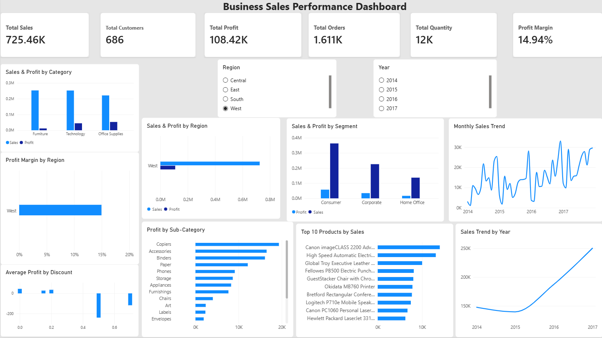

# Business Sales Performance Analytics

## Project Overview

This project analyzes the Superstore sales dataset to understand business sales performance, profitability, regional trends, product performance, and the relationship between discounts and profit.

The project includes data cleaning and exploratory analysis using Python and a client-ready interactive dashboard developed in Microsoft Power BI. The analysis focuses on identifying key business trends, profitability challenges, and actionable opportunities for improving sales performance.

## Objective

The objective of this project is to analyze sales and profitability patterns across products, categories, regions, and customer segments, and to identify areas where business performance can be improved.

The analysis focuses on:

- Revenue and profit trends over time
- Category and sub-category performance
- Regional sales and profitability
- Customer segment performance
- Top-performing and loss-making products
- The relationship between discount levels and profit
- Business insights and actionable recommendations

## Dataset

The project uses the Superstore Sales dataset, which contains transactional sales data including orders, customers, products, categories, regions, sales, discounts, quantities, and profit.

The dataset was used to analyze business performance across different time periods, product groups, regions, and customer segments.

## Tools & Technologies

- **Python** — Data cleaning, exploration, aggregation, and analysis
- **Pandas** — Data manipulation and analysis
- **Jupyter Notebook** — Exploratory data analysis
- **Microsoft Power BI** — Interactive dashboard and data visualization
- **Git & GitHub** — Version control and project documentation

## Data Preparation & Analysis

The dataset was first loaded and inspected using Python and Pandas.

The following data preparation and validation steps were performed:

- Checked the dataset structure, dimensions, and data types
- Verified that there were no missing values
- Checked for duplicate records
- Verified unique Order IDs and Customer IDs
- Converted Order Date and Ship Date from text to datetime format
- Checked for invalid sales and quantity values
- Verified that no shipping dates occurred before order dates
- Created Year and Month fields for time-based analysis
- Analyzed sales, profit, quantity, and discount patterns
- Identified loss-making transactions, products, and sub-categories
- Calculated profit margins across categories and regions

A cleaned version of the dataset was created as `superstore_cleaned.csv` for use in the Power BI dashboard.

## Dashboard Features

The Power BI dashboard provides an interactive overview of business sales performance.

Key dashboard components include:

- Total Sales
- Total Customers
- Total Profit
- Total Orders
- Total Quantity
- Overall Profit Margin
- Yearly Sales Trend
- Monthly Sales Trend
- Sales and Profit by Category
- Sales and Profit by Region
- Sales and Profit by Customer Segment
- Profit Margin by Region
- Profit by Sub-Category
- Top 10 Products by Sales
- Average Profit by Discount
- Year and Region slicers for interactive filtering

## Key Business Insights

### 1. Category Profitability

- Technology generated the highest total profit at **₹145,454.95** and had a profit margin of **17.40%**.
- Office Supplies generated **₹122,490.80** in profit with a profit margin of **17.04%**.
- Furniture generated **₹18,451.27** in profit despite generating **₹741,999.80** in sales, resulting in a much lower profit margin of **2.49%**.
- The large difference in profit margins indicates that Furniture requires further profitability analysis.

### 2. Regional Performance

- The **West** region generated the highest sales of **₹725,457.82** and the highest profit of **₹108,418.45**.
- West also recorded the highest regional profit margin at **14.94%**.
- The **Central** region had the lowest profit margin at **7.92%**, despite generating **₹501,239.89** in sales.
- This suggests that regional performance should be evaluated not only by sales volume but also by profitability.

### 3. Sub-Category Profitability

- **Tables** recorded the largest total loss among the sub-categories at **−₹17,725.48**, despite generating approximately **₹206,966** in sales.
- **Supplies** recorded a total loss of **−₹11,189.10**.
- **Bookcases** also recorded a total loss of **−₹3,472.56**.
- These loss-making sub-categories contribute to the lower profitability observed in certain product categories.

### 4. Discount and Profit

- Average profit was positive at lower discount levels but declined substantially as discount levels increased.
- At a **30% discount**, average profit became negative at approximately **−₹45.68**.
- Average profit became increasingly negative at higher discount levels, reaching approximately **−₹310.70** at a 50% discount.
- The analysis shows a strong association between higher discount levels and lower average profit. This relationship should be investigated further before making pricing decisions.

### 5. Loss-Making Products

- Several individual products recorded substantial cumulative losses.
- The **Cubify CubeX 3D Printer Double Head Print** recorded the largest product-level loss of approximately **−₹8,879.97**.
- Other significantly loss-making products included the **Lexmark MX611dhe Monochrome Laser Printer**, **Cubify Cube 3D Printer Triple Head Print**, and **Chromcraft Bull-Nose Wood Oval Conference Tables & Bases**.
- Reviewing consistently loss-making products can help identify opportunities for pricing, discount, or product-strategy adjustments.

## Business Recommendations

Based on the analysis, the following actions could help improve business performance and profitability:

### 1. Review Furniture Profitability

Investigate the pricing, discounting, and cost structure of Furniture products, as the category generated a relatively low profit margin of 2.49% despite substantial sales.

### 2. Investigate Loss-Making Sub-Categories

Conduct a detailed review of Tables, Supplies, and Bookcases, which recorded negative total profit. Identify the products and transactions contributing most to these losses.

### 3. Review High-Discount Transactions

Evaluate transactions with discounts of 30% or higher, as these discount levels were associated with negative average profit in the dataset. Consider more targeted discounting strategies where appropriate.

### 4. Investigate Regional Profitability

Examine the Central region's product mix, discount levels, and loss-making transactions to understand why its profit margin was lower than the other regions.

### 5. Review Consistently Loss-Making Products

Identify products with repeated negative profitability and evaluate whether pricing, discounts, costs, or product strategy should be adjusted.

### 6. Monitor Profitability Alongside Sales

Track both revenue and profit margin when evaluating categories, regions, products, and customer segments. High sales volume does not necessarily translate into high profitability.


## Project Structure

```text
FUTURE_DS_01/
│
├── data/
│   ├── superstore.csv
│   └── superstore_cleaned.csv
│
├── notebooks/
│   └── 01_data_exploration.ipynb
│
├── dashboard/
│   └── FUTURE_DS_01_Business_Sales_Performance.pbix
│
├── screenshots/
│   └── dashboard.png
│
├── README.md
└── .gitignore
├── README.md
└── .gitignore
```

## Files & Deliverables

### Data
- `superstore.csv` — Original Superstore dataset
- `superstore_cleaned.csv` — Cleaned and analysis-ready dataset

### Analysis
- `01_data_exploration.ipynb` — Python/Jupyter notebook containing data inspection, cleaning, exploratory analysis, and business analysis

### Dashboard
- `FUTURE_DS_01_Business_Sales_Performance.pbix` — Interactive Power BI dashboard containing KPIs, trends, category analysis, regional analysis, product analysis, and profitability analysis

### Documentation
- `README.md` — Project documentation, insights, and recommendations
- `screenshots/` — Dashboard screenshots for project presentation

## Dashboard Preview

The Power BI dashboard provides an interactive view of business sales performance, profitability, regional trends, product performance, and discount-related profitability.
## Dashboard Preview



### Dashboard Highlights

- KPI cards for Sales, Customers, Profit, Orders, Quantity, and Profit Margin
- Year and Region slicers for interactive filtering
- Sales and Profit analysis by Category, Region, and Segment
- Monthly and yearly sales trends
- Profit Margin by Region
- Profit by Sub-Category
- Top 10 Products by Sales
- Average Profit by Discount


## How to Reproduce

1. Clone or download this repository.
2. Open the project folder in Visual Studio Code.
3. Create and activate a Python virtual environment.
4. Install the required Python libraries.
5. Open `notebooks/01_data_exploration.ipynb`.
6. Select the project `.venv` as the Jupyter kernel.
7. Run the notebook cells to reproduce the data analysis.
8. Open `dashboard/FUTURE_DS_01_Business_Sales_Performance.pbix` in Microsoft Power BI Desktop to explore the interactive dashboard.


## Conclusion

The analysis provides an overview of the Superstore business performance across categories, regions, products, customer segments, and discount levels.

The results show that strong sales do not always translate into strong profitability. Technology and Office Supplies demonstrated relatively strong profit margins, while Furniture showed significantly lower profitability. Certain sub-categories and products recorded losses, and higher discount levels were associated with lower average profit.

The Power BI dashboard brings these findings together in an interactive format, helping users explore sales and profitability patterns and identify areas that may require further business investigation.